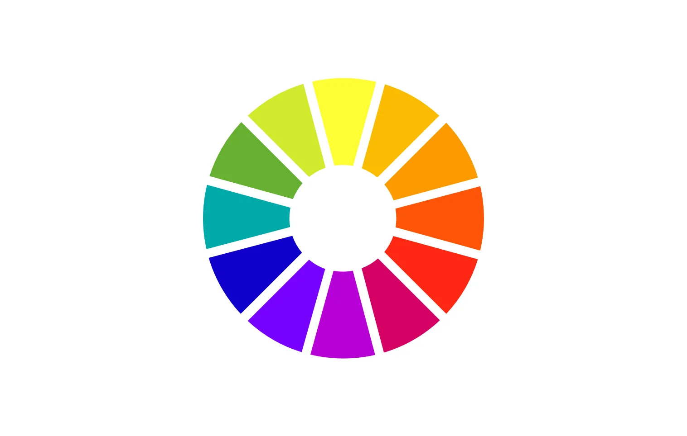
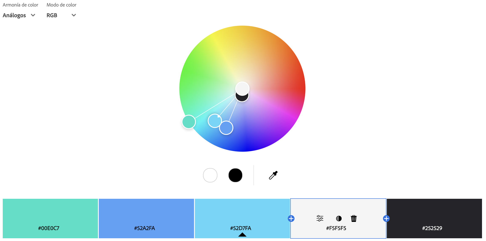
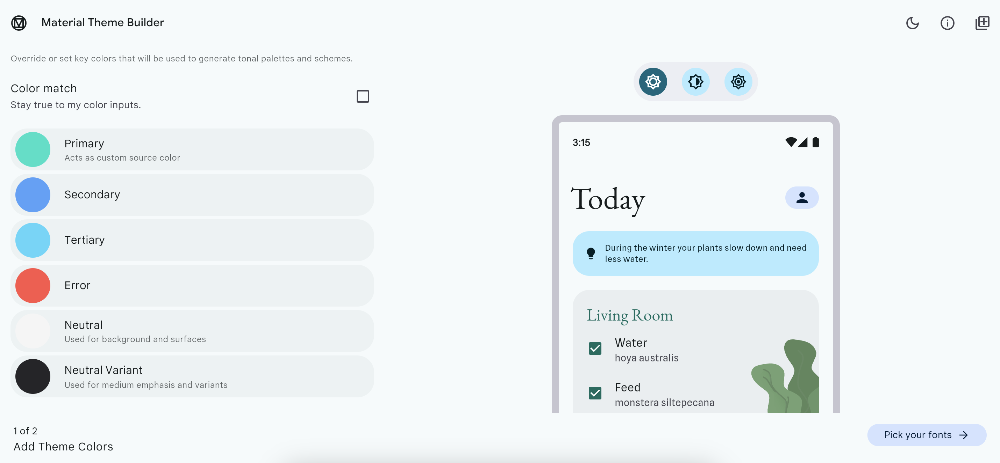
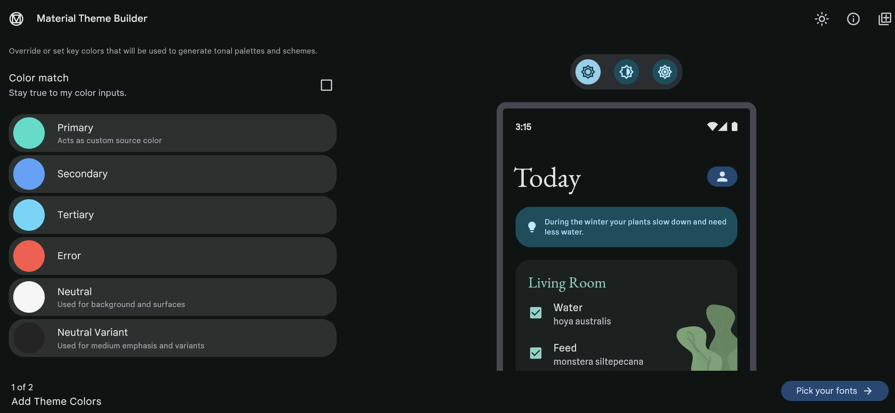
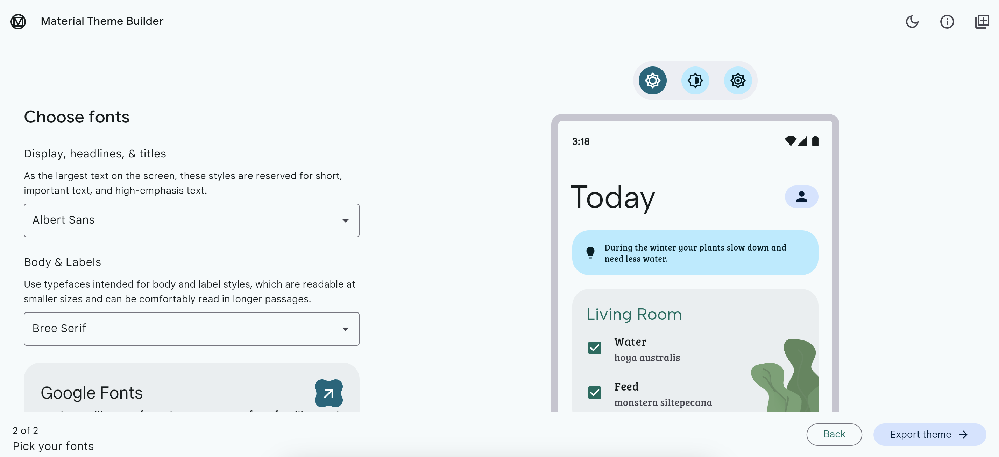

# Themes
¿Porqué agregar *Themes*? Los *Themes* son un aspecto muy importante para manejar los estilos de una app de forma escalable, por eso considero que debe ser el segundo aspecto que debemos aprender cuando creamos una app en Flutter, ya que si tenemos el conocimiento para crear temas en una app antes de crear multiples vistas o widgets, podremos aplicar un estilo coherente y uniforme a toda la aplicación de manera más eficiente. Esto no solo mejora la estética y la experiencia del usuario, sino que también facilita el mantenimiento y la escalabilidad del proyecto.

Ahora antes de iniciar con la configuraciones y métodos que usa *Flutter* para crear temas debes conocer las Guías de lineamientos de diseños más importantes y populares en la industria, estas son `Material Design` de Google y `Human Interface` y de Apple, estas dos guías te van a ayudar a crear diseños más amigables y eficaces para los usuarios. 

Cuando definimos la configuración de temas en *Flutter* por lo general hacemos referencia a dos aspectos `Colores` y `Fuentes`. Estos dos elementos se deben ser configurados en la siguiente clase.

# ThemeData Class
*ThemeData* es la clase que nos permite configurar las propiedades visuales de la app. Por lo general *ThemeData* se agrega en la propiedad theme de la clase `MaterialApp` esto hace que los parámetros visuales definidos se apliquen en toda la app. *para tener más información sobre la clase consulta la siguiente documentación [ThemeData docs.](https://api.flutter.dev/flutter/material/ThemeData-class.html)*

_**Nota:**_ El método estático *Theme.of* encuentra el valor *ThemeData* del ancestro más cercano.

```dart
class ThemeDataExampleApp extends StatelessWidget {
  const ThemeDataExampleApp({super.key});

  @override
  Widget build(BuildContext context) {
    final ColorScheme colorScheme = ColorScheme.fromSeed(
      brightness: MediaQuery.platformBrightnessOf(context),
      seedColor: Colors.indigo,
    );

    return MaterialApp(
      title: 'ThemeData Demo',
      theme: ThemeData( // <----- ThemeData 
        colorScheme: colorScheme,
        floatingActionButtonTheme: FloatingActionButtonThemeData(
          backgroundColor: colorScheme.tertiary,
          foregroundColor: colorScheme.onTertiary,
        ),
      ),
      home: const Home(),
    );
  }
}
```

La clase *ThemeData* tiene propiedades para configurar de forma general cada uno de los widgets, Ej: `floatingActionButtonTheme`, `cardTheme`, etc. Sin embargo lo más común es configurar `colorScheme` y `textTheme` ya que estas propiedades afectan de forma general a toda la app.

## ColorScheme
ColorScheme define un conjunto de 45 colores basados en los `Material specs` que pueden ser usados para configurar las propiedades de la mayoría de los componentes.

En `Material specs` (específicamente *Material 3*) los colores son representados por `color roles` y estos corresponden a tokens. Los principales grupos de colores de acento en el `scheme` son:
- **Primary:** Este grupo de colores se utilizan para los componentes clave en la interfaz del usuario (componentes que destacan), como los FAB (Floating Action Button), prominent buttons, y componentes que representen estados activos.
- **Secondary:** Este grupo de colores se utilizan para componentes menos destacados en la interfaz de usuario. como los Chips, o demás elementos que le permitan a los diseñadores destacar componentes aumentando la oportunidad expresión de colores.
- **Tertiary:** Este grupo de colores se utiliza para crear acentos contrastantes permitiendo equilibrar los grupos de colores `primary` y `secondary` llamando la atención del usuario a un elemento en especifico, como un campo de entrada. Este grupo de colores se deja más en el criterio de los diseñadores y están pensados para respaldar una expresión cromática más amplia en las interfaces.

## TextTheme
Son las definiciones de diferentes estilos tipográficos encontrados en `Material Design`, estos definen el tamaño, el espaciado y el "grosor" según su jerarquía.

Para obtener el tema del texto actual se debe llamar al método estático *Theme.of* y leer la propiedad *ThemeData.TextTheme*.

A continuación va a ver una tabla con la jerarquía y propiedades que tienen las diferentes definiciones de *TextTheme*:


| **NAME**         | **SIZE** | **WEIGHT** | **SPACING** |
|------------------|----------|------------|-------------|
| displayLarge     | 96.0     | light      | -1.5        |
| displayMedium    | 60.0     | light      | -0.5        |
| displaySmall     | 48.0     | regular    | 0.0         |
| headlineMedium   | 34.0     | regular    | 0.25        |
| headlineSmall    | 24.0     | regular    | 0.0         |
| titleLarge       | 20.0     | medium     | 0.15        |
| titleMedium      | 16.0     | regular    | 0.15        |
| titleSmall       | 14.0     | medium     | 0.1         |
| labelLarge       | 14.0     | medium     | 0.1         |
| labelMedium      | 12.0     | medium     | 0.5         |
| labelSmall       | 10.0     | regular    | 0.5         |
| bodyLarge        | 16.0     | regular    | 0.15        |
| bodyMedium       | 14.0     | regular    | 0.25        |
| bodySmall        | 12.0     | regular    | 0.4         |

Con el propósito de mostrarte herramientas que faciliten el proceso de crear temas visualmente atractivos y que sigas conceptos teóricos que hagan que tus app se vean más hermosas, vamos a crear un temas, claro y oscuro de la siguiente manera:

# Genera tu paleta de colores.


Para poder generar tú paleta de colores es importante que conozcas un poco sobre la **Teoría del color** ya que con esta teoría puedes extraer los colores complementarios, análogos, compuesto, etc. y usarlos a tú favor, No soy muy experto en el diseño UI/UX, pero aquí te van algunos consejos sobre el uso de las paletas de colores:
- **Paleta Monocromática:** Utiliza diferentes tonos, sombras y saturaciones de un color base, se aconseja utilizarla para aplicaciones que tengan una estética muy limpia, como apps administrativas, empresariales o de producción.
- **Paleta Análoga:** Combina colores que están "uno al lado del otro" en la rueda de colores. se aconseja utilizar para aplicaciones que reflejen una apariencia cálida y acogedora, como apps de salud, bienestar o educación.
- **Paleta Complementaria:** Utiliza "colores opuestos" en la rueda de colores creando un contraste fuerte y vibrante. se aconseja utilizarla en aplicaciones que necesiten llamar la atención sobre ciertos elementos, app de marketing, ventas o retail.
- **paleta Triádica:** Combina "tres colores equidistantes" en la rueda de colores ofreciendo equilibro entre contraste y armonía. Se aconseja utilizarla en app creativas, entretenimiento o infantiles.

Ahora bien, recuerda que todo esto son guías más no son "leyes absolutas" por lo que es tu decision el seguir estos consejos y lineamientos, no es necesario solo usar una paleta de colores, de hecho en muchos casos la interfaz de la app se crea utilizando la combinación de varias paletas de colores, todo en búsqueda de una armonía en tu app. Lo importante de todas estas herramientas y lineamientos  es ayudarte a construir un criterio al momento de crear tu app y no solo quedarte en lo que "te gusta".

Te recomiendo que sigas las guías de lineamientos, tanto de Apple [Human Interface](https://developer.apple.com/design/human-interface-guidelines) como de Google [Material Design](https://m3.material.io/), que conozcas más sobre la [teoría del color](https://medium.com/@christvizcarra/todo-lo-que-debes-saber-de-colores-en-ui-design-teor%C3%ADa-y-pr%C3%A1ctica-f1fc444e7d86) y aprendas cada vez más sobre diseño UI/UX para que puedas mejorar exponencialmente la experiencia de usuario en tus apps.

Sin embargo por razones prácticas en este Blog vamos a utilizar la herramienta que Adobe proporciona para generar paletas de colores [Adobe Color Wheel](https://color.adobe.com/es/create/color-wheel).



# Selecciona la tipografía
Definir la tipografía para tu app es de los aspectos más importantes. Esto se debe a que no solo ayuda con la estética de la aplicación sino que influye en la toma de decisiones del usuario ya que afecta directamente a la legibilidad. Es por esto que te voy a dar los siguientes tips:
1. **Coherencia con la marca:** La tipografía debe alinearse con la identidad de la marca, la elección de la fuente debe reflejar el estilo y tono de la aplicación. Una aplicación formal por lo general suele usar fuentes *Serif*, mientras que una aplicación moderna y mas casual suele usar fuentes *Sans-Serif*.
2. **Compatibilidad:** Asegúrate de que la fuente que elijas se vea bien en todos los dispositivos y sistemas operativos disponibles para tu app. No olvides verificar las licencias de uso que puede tener la fuente.
3. **Usabilidad:** Verifica que la fuente tenga disponibilidad en los diferentes "pesos" y estilos: *light, regular, bold; italic, normal*.

Finalmente debes tener en cuenta que hay 3 aspectos principales que pueden afectar la **Legibilidad** de tu tipografía: El tamaño de la fuentes, el contraste (color de la fuente vs el fondo) y el interlineado.

Teniendo en cuenta los aspectos anteriores para el tema de esta app utilizamos las fuentes: Albert Sans para títulos y headers, Bree Serif para cuerpos de texto y labels.

# Creando Nuestro Tema en Flutter

¡Listoo! ya tenemos los colores y fuentes que queremos implementar, ahora los podemos utilizar para crear nuestro tema, para esto vamos a usar el [Theme builder](https://material-foundation.github.io/material-theme-builder/) que nos proporciona `Material design` facilitando la creación de la clase `ThemeData`.



Como puedes ver agregué los colores proporcionados por la paleta de colores, como primario, secundario, terciario, etc. lo bueno es que **Theme Builder** crea las opciones tanto para tema claro como para tema oscuro.



Para continuar, le damos a **Pick your fonts** y seleccionamos las fuentes que deseemos.

_**Nota:** las fuentes disponibles en esta herramienta son las que puedes encontrar en Google fonts_



para finalizar solo debes darle **Export theme** y selecciona la opción de _**Flutter**_.

Vale, ya que explicamos los conceptos básicos, las propiedades mas importantes al momento de crear un tema y como agregar *Themes* a una aplicación *Flutter*, ¡vamos a codear 👨🏽‍💻!

Lo primero que vamos a hacer es instalar e importar el paquete `google_fonts`
```bash
flutter pub add google_fonts
```
Después vamos a agregar un archivo llamado `themes.dart` al proyecto, yo por lo general ubico este archivo en la siguiente ruta dentro del proyecto `./lib/config/themes/themes.dart`. A este archivo le vamos a agregar la clase **Material Theme** y el método **CreateTextTheme** de los archivos proporcionados por el `Theme builder`.

```dart
import "package:flutter/material.dart";
import 'package:google_fonts/google_fonts.dart';

TextTheme createTextTheme(BuildContext context, String bodyFontString, String displayFontString) {
  TextTheme baseTextTheme = Theme.of(context).textTheme;
  TextTheme bodyTextTheme = GoogleFonts.getTextTheme(bodyFontString, baseTextTheme);
  TextTheme displayTextTheme = GoogleFonts.getTextTheme(displayFontString, baseTextTheme);
  TextTheme textTheme = displayTextTheme.copyWith(
    bodyLarge: bodyTextTheme.bodyLarge,
    bodyMedium: bodyTextTheme.bodyMedium,
    bodySmall: bodyTextTheme.bodySmall,
    labelLarge: bodyTextTheme.labelLarge,
    labelMedium: bodyTextTheme.labelMedium,
    labelSmall: bodyTextTheme.labelSmall,
  );
  return textTheme;
}

class MaterialTheme {
  final TextTheme textTheme;

  const MaterialTheme(this.textTheme);

  static ColorScheme lightScheme() {
    return const ColorScheme(
      brightness: Brightness.light,
      primary: Color(0xff006b5e),
      surfaceTint: Color(0xff006b5e),
      onPrimary: Color(0xffffffff),
      primaryContainer: Color(0xff9ff2e1),
      onPrimaryContainer: Color(0xff00201b),
      secondary: Color(0xff39608f),
      onSecondary: Color(0xffffffff),
      secondaryContainer: Color(0xffd3e4ff),
      onSecondaryContainer: Color(0xff001c38),
      tertiary: Color(0xff00677c),
      onTertiary: Color(0xffffffff),
      tertiaryContainer: Color(0xffb1ecff),
      onTertiaryContainer: Color(0xff001f27),
      error: Color(0xffba1a1a),
      onError: Color(0xffffffff),
      errorContainer: Color(0xffffdad6),
      onErrorContainer: Color(0xff410002),
      surface: Color(0xfff5fafb),
      onSurface: Color(0xff171d1e),
      onSurfaceVariant: Color(0xff46464f),
      outline: Color(0xff767680),
      outlineVariant: Color(0xffc6c5d0),
      shadow: Color(0xff000000),
      scrim: Color(0xff000000),
      inverseSurface: Color(0xff2b3133),
      inversePrimary: Color(0xff83d5c6),
      primaryFixed: Color(0xff9ff2e1),
      onPrimaryFixed: Color(0xff00201b),
      primaryFixedDim: Color(0xff83d5c6),
      onPrimaryFixedVariant: Color(0xff005046),
      secondaryFixed: Color(0xffd3e4ff),
      onSecondaryFixed: Color(0xff001c38),
      secondaryFixedDim: Color(0xffa3c9fe),
      onSecondaryFixedVariant: Color(0xff1e4875),
      tertiaryFixed: Color(0xffb1ecff),
      onTertiaryFixed: Color(0xff001f27),
      tertiaryFixedDim: Color(0xff86d1e9),
      onTertiaryFixedVariant: Color(0xff004e5e),
      surfaceDim: Color(0xffd5dbdc),
      surfaceBright: Color(0xfff5fafb),
      surfaceContainerLowest: Color(0xffffffff),
      surfaceContainerLow: Color(0xffeff5f6),
      surfaceContainer: Color(0xffe9eff0),
      surfaceContainerHigh: Color(0xffe3e9ea),
      surfaceContainerHighest: Color(0xffdee3e5),
    );
  }

  ThemeData light() {
    return theme(lightScheme());
  }

  static ColorScheme lightMediumContrastScheme() {
    return const ColorScheme(
      brightness: Brightness.light,
      primary: Color(0xff004c43),
      surfaceTint: Color(0xff006b5e),
      onPrimary: Color(0xffffffff),
      primaryContainer: Color(0xff2a8274),
      onPrimaryContainer: Color(0xffffffff),
      secondary: Color(0xff184471),
      onSecondary: Color(0xffffffff),
      secondaryContainer: Color(0xff5077a7),
      onSecondaryContainer: Color(0xffffffff),
      tertiary: Color(0xff004a59),
      onTertiary: Color(0xffffffff),
      tertiaryContainer: Color(0xff2c7e94),
      onTertiaryContainer: Color(0xffffffff),
      error: Color(0xff8c0009),
      onError: Color(0xffffffff),
      errorContainer: Color(0xffda342e),
      onErrorContainer: Color(0xffffffff),
      surface: Color(0xfff5fafb),
      onSurface: Color(0xff171d1e),
      onSurfaceVariant: Color(0xff42424b),
      outline: Color(0xff5e5e67),
      outlineVariant: Color(0xff7a7a83),
      shadow: Color(0xff000000),
      scrim: Color(0xff000000),
      inverseSurface: Color(0xff2b3133),
      inversePrimary: Color(0xff83d5c6),
      primaryFixed: Color(0xff2a8274),
      onPrimaryFixed: Color(0xffffffff),
      primaryFixedDim: Color(0xff00685c),
      onPrimaryFixedVariant: Color(0xffffffff),
      secondaryFixed: Color(0xff5077a7),
      onSecondaryFixed: Color(0xffffffff),
      secondaryFixedDim: Color(0xff365e8c),
      onSecondaryFixedVariant: Color(0xffffffff),
      tertiaryFixed: Color(0xff2c7e94),
      onTertiaryFixed: Color(0xffffffff),
      tertiaryFixedDim: Color(0xff006579),
      onTertiaryFixedVariant: Color(0xffffffff),
      surfaceDim: Color(0xffd5dbdc),
      surfaceBright: Color(0xfff5fafb),
      surfaceContainerLowest: Color(0xffffffff),
      surfaceContainerLow: Color(0xffeff5f6),
      surfaceContainer: Color(0xffe9eff0),
      surfaceContainerHigh: Color(0xffe3e9ea),
      surfaceContainerHighest: Color(0xffdee3e5),
    );
  }

  ThemeData lightMediumContrast() {
    return theme(lightMediumContrastScheme());
  }

  static ColorScheme lightHighContrastScheme() {
    return const ColorScheme(
      brightness: Brightness.light,
      primary: Color(0xff002822),
      surfaceTint: Color(0xff006b5e),
      onPrimary: Color(0xffffffff),
      primaryContainer: Color(0xff004c43),
      onPrimaryContainer: Color(0xffffffff),
      secondary: Color(0xff002343),
      onSecondary: Color(0xffffffff),
      secondaryContainer: Color(0xff184471),
      onSecondaryContainer: Color(0xffffffff),
      tertiary: Color(0xff00262f),
      onTertiary: Color(0xffffffff),
      tertiaryContainer: Color(0xff004a59),
      onTertiaryContainer: Color(0xffffffff),
      error: Color(0xff4e0002),
      onError: Color(0xffffffff),
      errorContainer: Color(0xff8c0009),
      onErrorContainer: Color(0xffffffff),
      surface: Color(0xfff5fafb),
      onSurface: Color(0xff000000),
      onSurfaceVariant: Color(0xff23232b),
      outline: Color(0xff42424b),
      outlineVariant: Color(0xff42424b),
      shadow: Color(0xff000000),
      scrim: Color(0xff000000),
      inverseSurface: Color(0xff2b3133),
      inversePrimary: Color(0xffa8fceb),
      primaryFixed: Color(0xff004c43),
      onPrimaryFixed: Color(0xffffffff),
      primaryFixedDim: Color(0xff00332c),
      onPrimaryFixedVariant: Color(0xffffffff),
      secondaryFixed: Color(0xff184471),
      onSecondaryFixed: Color(0xffffffff),
      secondaryFixedDim: Color(0xff002e55),
      onSecondaryFixedVariant: Color(0xffffffff),
      tertiaryFixed: Color(0xff004a59),
      onTertiaryFixed: Color(0xffffffff),
      tertiaryFixedDim: Color(0xff00323d),
      onTertiaryFixedVariant: Color(0xffffffff),
      surfaceDim: Color(0xffd5dbdc),
      surfaceBright: Color(0xfff5fafb),
      surfaceContainerLowest: Color(0xffffffff),
      surfaceContainerLow: Color(0xffeff5f6),
      surfaceContainer: Color(0xffe9eff0),
      surfaceContainerHigh: Color(0xffe3e9ea),
      surfaceContainerHighest: Color(0xffdee3e5),
    );
  }

  ThemeData lightHighContrast() {
    return theme(lightHighContrastScheme());
  }

  static ColorScheme darkScheme() {
    return const ColorScheme(
      brightness: Brightness.dark,
      primary: Color(0xff83d5c6),
      surfaceTint: Color(0xff83d5c6),
      onPrimary: Color(0xff003730),
      primaryContainer: Color(0xff005046),
      onPrimaryContainer: Color(0xff9ff2e1),
      secondary: Color(0xffa3c9fe),
      onSecondary: Color(0xff00315b),
      secondaryContainer: Color(0xff1e4875),
      onSecondaryContainer: Color(0xffd3e4ff),
      tertiary: Color(0xff86d1e9),
      onTertiary: Color(0xff003642),
      tertiaryContainer: Color(0xff004e5e),
      onTertiaryContainer: Color(0xffb1ecff),
      error: Color(0xffffb4ab),
      onError: Color(0xff690005),
      errorContainer: Color(0xff93000a),
      onErrorContainer: Color(0xffffdad6),
      surface: Color(0xff0e1415),
      onSurface: Color(0xffdee3e5),
      onSurfaceVariant: Color(0xffc6c5d0),
      outline: Color(0xff90909a),
      outlineVariant: Color(0xff46464f),
      shadow: Color(0xff000000),
      scrim: Color(0xff000000),
      inverseSurface: Color(0xffdee3e5),
      inversePrimary: Color(0xff006b5e),
      primaryFixed: Color(0xff9ff2e1),
      onPrimaryFixed: Color(0xff00201b),
      primaryFixedDim: Color(0xff83d5c6),
      onPrimaryFixedVariant: Color(0xff005046),
      secondaryFixed: Color(0xffd3e4ff),
      onSecondaryFixed: Color(0xff001c38),
      secondaryFixedDim: Color(0xffa3c9fe),
      onSecondaryFixedVariant: Color(0xff1e4875),
      tertiaryFixed: Color(0xffb1ecff),
      onTertiaryFixed: Color(0xff001f27),
      tertiaryFixedDim: Color(0xff86d1e9),
      onTertiaryFixedVariant: Color(0xff004e5e),
      surfaceDim: Color(0xff0e1415),
      surfaceBright: Color(0xff343a3b),
      surfaceContainerLowest: Color(0xff090f10),
      surfaceContainerLow: Color(0xff171d1e),
      surfaceContainer: Color(0xff1b2122),
      surfaceContainerHigh: Color(0xff252b2c),
      surfaceContainerHighest: Color(0xff303637),
    );
  }

  ThemeData dark() {
    return theme(darkScheme());
  }

  static ColorScheme darkMediumContrastScheme() {
    return const ColorScheme(
      brightness: Brightness.dark,
      primary: Color(0xff87daca),
      surfaceTint: Color(0xff83d5c6),
      onPrimary: Color(0xff001a16),
      primaryContainer: Color(0xff4b9e90),
      onPrimaryContainer: Color(0xff000000),
      secondary: Color(0xffa9cdff),
      onSecondary: Color(0xff00172f),
      secondaryContainer: Color(0xff6d93c5),
      onSecondaryContainer: Color(0xff000000),
      tertiary: Color(0xff8ad6ed),
      onTertiary: Color(0xff001920),
      tertiaryContainer: Color(0xff4d9bb1),
      onTertiaryContainer: Color(0xff000000),
      error: Color(0xffffbab1),
      onError: Color(0xff370001),
      errorContainer: Color(0xffff5449),
      onErrorContainer: Color(0xff000000),
      surface: Color(0xff0e1415),
      onSurface: Color(0xfff6fcfd),
      onSurfaceVariant: Color(0xffcbcad4),
      outline: Color(0xffa3a2ac),
      outlineVariant: Color(0xff82828c),
      shadow: Color(0xff000000),
      scrim: Color(0xff000000),
      inverseSurface: Color(0xffdee3e5),
      inversePrimary: Color(0xff005248),
      primaryFixed: Color(0xff9ff2e1),
      onPrimaryFixed: Color(0xff001511),
      primaryFixedDim: Color(0xff83d5c6),
      onPrimaryFixedVariant: Color(0xff003e36),
      secondaryFixed: Color(0xffd3e4ff),
      onSecondaryFixed: Color(0xff001226),
      secondaryFixedDim: Color(0xffa3c9fe),
      onSecondaryFixedVariant: Color(0xff033764),
      tertiaryFixed: Color(0xffb1ecff),
      onTertiaryFixed: Color(0xff00141a),
      tertiaryFixedDim: Color(0xff86d1e9),
      onTertiaryFixedVariant: Color(0xff003c49),
      surfaceDim: Color(0xff0e1415),
      surfaceBright: Color(0xff343a3b),
      surfaceContainerLowest: Color(0xff090f10),
      surfaceContainerLow: Color(0xff171d1e),
      surfaceContainer: Color(0xff1b2122),
      surfaceContainerHigh: Color(0xff252b2c),
      surfaceContainerHighest: Color(0xff303637),
    );
  }

  ThemeData darkMediumContrast() {
    return theme(darkMediumContrastScheme());
  }

  static ColorScheme darkHighContrastScheme() {
    return const ColorScheme(
      brightness: Brightness.dark,
      primary: Color(0xffebfff9),
      surfaceTint: Color(0xff83d5c6),
      onPrimary: Color(0xff000000),
      primaryContainer: Color(0xff87daca),
      onPrimaryContainer: Color(0xff000000),
      secondary: Color(0xfffafaff),
      onSecondary: Color(0xff000000),
      secondaryContainer: Color(0xffa9cdff),
      onSecondaryContainer: Color(0xff000000),
      tertiary: Color(0xfff5fcff),
      onTertiary: Color(0xff000000),
      tertiaryContainer: Color(0xff8ad6ed),
      onTertiaryContainer: Color(0xff000000),
      error: Color(0xfffff9f9),
      onError: Color(0xff000000),
      errorContainer: Color(0xffffbab1),
      onErrorContainer: Color(0xff000000),
      surface: Color(0xff0e1415),
      onSurface: Color(0xffffffff),
      onSurfaceVariant: Color(0xfffdfaff),
      outline: Color(0xffcbcad4),
      outlineVariant: Color(0xffcbcad4),
      shadow: Color(0xff000000),
      scrim: Color(0xff000000),
      inverseSurface: Color(0xffdee3e5),
      inversePrimary: Color(0xff00302a),
      primaryFixed: Color(0xffa3f6e6),
      onPrimaryFixed: Color(0xff000000),
      primaryFixedDim: Color(0xff87daca),
      onPrimaryFixedVariant: Color(0xff001a16),
      secondaryFixed: Color(0xffdae8ff),
      onSecondaryFixed: Color(0xff000000),
      secondaryFixedDim: Color(0xffa9cdff),
      onSecondaryFixedVariant: Color(0xff00172f),
      tertiaryFixed: Color(0xffbeeeff),
      onTertiaryFixed: Color(0xff000000),
      tertiaryFixedDim: Color(0xff8ad6ed),
      onTertiaryFixedVariant: Color(0xff001920),
      surfaceDim: Color(0xff0e1415),
      surfaceBright: Color(0xff343a3b),
      surfaceContainerLowest: Color(0xff090f10),
      surfaceContainerLow: Color(0xff171d1e),
      surfaceContainer: Color(0xff1b2122),
      surfaceContainerHigh: Color(0xff252b2c),
      surfaceContainerHighest: Color(0xff303637),
    );
  }

  ThemeData darkHighContrast() {
    return theme(darkHighContrastScheme());
  }

  ThemeData theme(ColorScheme colorScheme) => ThemeData(
        useMaterial3: true,
        brightness: colorScheme.brightness,
        colorScheme: colorScheme,
        textTheme: textTheme.apply(
          bodyColor: colorScheme.onSurface,
          displayColor: colorScheme.onSurface,
        ),
        scaffoldBackgroundColor: colorScheme.surface,
        canvasColor: colorScheme.surface,
      );

  List<ExtendedColor> get extendedColors => [];
}

class ExtendedColor {
  final Color seed, value;
  final ColorFamily light;
  final ColorFamily lightHighContrast;
  final ColorFamily lightMediumContrast;
  final ColorFamily dark;
  final ColorFamily darkHighContrast;
  final ColorFamily darkMediumContrast;

  const ExtendedColor({
    required this.seed,
    required this.value,
    required this.light,
    required this.lightHighContrast,
    required this.lightMediumContrast,
    required this.dark,
    required this.darkHighContrast,
    required this.darkMediumContrast,
  });
}

class ColorFamily {
  const ColorFamily({
    required this.color,
    required this.onColor,
    required this.colorContainer,
    required this.onColorContainer,
  });

  final Color color;
  final Color onColor;
  final Color colorContainer;
  final Color onColorContainer;
}
```

## Crear proveedor del tema

